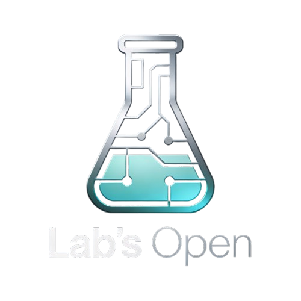

<!--START_SECTION:header-->
<div align="center">
  
  
  <h1 align="center">👋 Olá, seja bem-vindo ao meu universo dev!</h1>
  <p align="center">
    
    
  </p>
</div>
<!--END_SECTION:header-->

---

### ✨ Sobre mim

```yaml
nome: Alexandre Nogueira de Lira
local: Vilhena - RO, Brasil
origem: Guajará-Mirim - RO, Brasil
atuação: Software Developer
formação: IFRO - Instituto Federal de Rondônia
empresa: Grupo NetWay
```

Sou um desenvolvedor apaixonado por tecnologia, design de interfaces e soluções inteligentes. Tenho grande interesse em sistemas escaláveis, automações e integração de APIs — sempre guiado pelo ideal da Verdade e da evolução constante.

---

### 📫 Conecte-se comigo

<div align="center">
  <a href="https://www.linkedin.com/in/alxdelira/" target="_blank"></a>
  <a href="https://www.instagram.com/alx.delira" target="_blank"></a>
  <a href="mailto:alx.delira@gmail.com"></a>
</div>

---

### 🧠 Tecnologias e Especialidades

<div align="center">
  
  
  
  
  
  
  
  
  
</div>

---

### 🛠️ Ferramentas e Plataformas

<div align="center">
  
  
  
  
  
  
</div>

---

### 📊 Estatísticas GitHub

<div align="center">
  
  
  
</div>

---

### 🏆 Conquistas

<p align="center">
  <a href="https://github.com/ryo-ma/github-profile-trophy"></a>
</p>

---

### 📌 Projetos em Destaque

<div align="center">
  <a href="https://github.com/Alxdelira/api-jfro">
    
  </a>
  <a href="https://github.com/Alxdelira/service-shopper-iamges">
    
  </a>
</div>

---

### ⏱️ WakaTime

<div align="center">
  
</div>

---

### ⚡ Contato e Portfólio

<p align="center">
  ⌨️ Feito com 💜 por <a href="https://portfolioalxdelira.vercel.app/">🖖 AlxDelira</a>
</p>

<p align="center">
  <a href="https://portfolioalxdelira.vercel.app/" target="_blank">
    
  </a>
</p>
