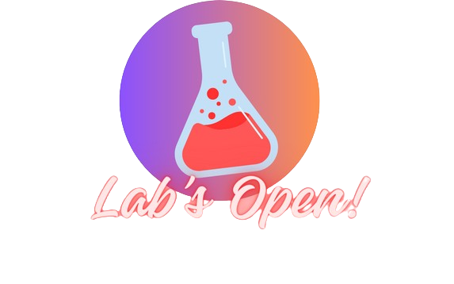

<!--START_SECTION:header-->

  

  <h1 align="center">Alexandre Nogueira de Lira</h1>

  

    IT Supervisor · Full‑Stack / Data 
    Systems Architecture · APIs · Automation & Observability
  

  <!-- Social / CTA badges -->
  

    
    
    
    
  

  <!-- GitHub / status badges -->
  

    
    
    
  

<!--END_SECTION:header-->

---

## 👋 About me

I’m an IT Supervisor and **Full‑Stack / Data** Developer focused on turning day‑to‑day operations into **platforms, APIs, and automations** that create measurable business impact.

At **Grupo NetWay**, I work at the intersection of technical teams and business areas—designing solutions that reduce failures, increase productivity, and improve the experience of the people on the front line (customers and internal teams).

- 🌍 Based in: Vilhena/RO · From: Guajará‑Mirim/RO  
- 🎓 Education: FAEL  
- 🎯 Specializations: Data Engineering · Web Development · MBA in Corporate Management  

> I like connecting **business, data, and engineering**: less bureaucracy, more results.

---

## 🧠 Technical profile in 3 lines

- **Backend‑first**: Node.js, TypeScript, NestJS, system integrations, automation, and well‑designed APIs.  
- **Data‑aware**: I use data to guide decisions, build reports, and enable management KPIs.  
- **Hands‑on + leadership**: I code while also defining architecture, standards, and aligning teams.

---

## 🚀 What I focus on

- **API / services architecture & development**  
  Design and evolve domain‑driven backends, integrating legacy systems, databases, and SaaS services.

- **Automation and internal tooling**  
  Build dashboards, scripts, and internal apps that reduce manual work and increase operational visibility.

- **Data for decision‑making**  
  Connect databases, structure queries, and feed tools like Metabase to deliver executive insights.

- **Technical leadership**  
  Standards, code review, alignment with product/business, and support for support/operations teams.

---

## 🛠️ Tech Radar

### Core

### Data & Databases

### DevOps & Tooling

---

## 📌 Projects worth checking out

- **Automation / Metabase Scripts**  
  Node.js scripts to bulk import native queries into Metabase via API, including JSON formatting, `dataset_query` mapping, and automatic card creation.

- **Internal APIs / Inventory & Fleet**  
  APIs and systems for asset inventory and fleet management, focused on internal processes, reporting, and integrations with other tools.

- **Books Platform – Grupo NetWay**  
  Internal system for managing a library collection and book lending, supporting a continuous learning culture.

---

## 🎯 For recruiters & technical leads

A good fit for teams that need someone who:

- understands **infrastructure, support, and software development** at the same time;  
- takes ownership of **APIs, integrations, and internal applications**;  
- helps turn firefighting into a **predictable, observable process**.

Relevant roles:

- Software Engineer (Back‑End / Full‑Stack)  
- Node.js / TypeScript Developer  
- Tech Lead / IT Supervisor  
- Engineer focused on integrations and internal automation  

> Want to talk about real team pain (support, product, data)? Reach out on LinkedIn or via email and let’s chat—no pressure.

---

## 📬 Where to find me

- 🔗 LinkedIn: [linkedin.com/in/alexandrenogueira-dev](https://www.linkedin.com/in/alexandrenogueira-dev/)  
- 🌐 Portfolio: [nogueira.dev.br](https://nogueira.dev.br)  
- 📷 Instagram: [instagram.com/alx.delira](https://www.instagram.com/alx.delira)  
- ✉️ Email: [alx.delira@gmail.com](mailto:alx.delira@gmail.com)

  

